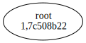
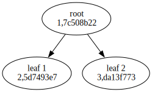
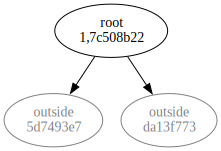
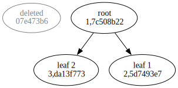

# taskwarrior-to-dot

## Description

Visualize tasks dependencies in taskwarrior via graphviz.

## Install

### `cabal`

```bash
git clone https://github.com/wrvsrx/taskwarrior-to-dot
cd taskwarrior-to-dot
cabal build
```

### `nix`

```bash
nix build github:wrvsrx/taskwarrior-to-dot
```

## Usage

```
Usage: taskwarrior-to-dot [-h|--highlights ARG] [-i|--impure] [-o|--outside] 
                          [-d|--deleted]

  taskwarrior-to-dot: convert taskwarrior json to dot

Available options:
  -h,--highlights ARG      Tags to be highlighted.
  -i,--impure              Enable impure mode. In impure mode, dependency
                           closure will be visualized.
  -o,--outside             Show tasks not appearing in input json.
  -d,--deleted             Show deleted tasks.
  -h,--help                Show this help text
```

## Examples

Assume there're following tasks, `root` depends on `leaf 1` and `leaf 2`.

```
ID St UUID     Age   Done  D Description
-- -- -------- ----- ----- - -----------
 - D  07e473b6 27s   16s     deleted
 3 P  da13f773 33min         leaf 2
 2 P  5d7493e7 33min         leaf 1
 1 P  7c508b22 33min       D root

4 tasks
```

- By default, only the tasks present in the exported JSON will be visualized, deleted tasks will be ignored.

  ```bash
  task 1 export | taskwarrior-to-dot | dot -T svg > default.svg
  ```

  Output:

  

- If enable `--impure` flag, dependency closure will be visualized.

  ```bash
  task 1 export | taskwarrior-to-dot --impure | dot -T svg > impure.svg
  ```

  Output:

  

- If enable `--outside` flag, dependency outside exported JSON will be shown as `outside`.

  ```bash
  task 1 export | taskwarrior-to-dot --outside | dot -T svg > outside.svg
  ```

  Output:

  

- If enable `--deleted` flag, deleted tasks will be shown.

  ```bash
  task export all | taskwarrior-to-dot --deleted | dot -T svg > deleted.svg
  ```

  Output:

  

## Remarks

By default, tasks with tag `giveup` will be shown as underlined.
